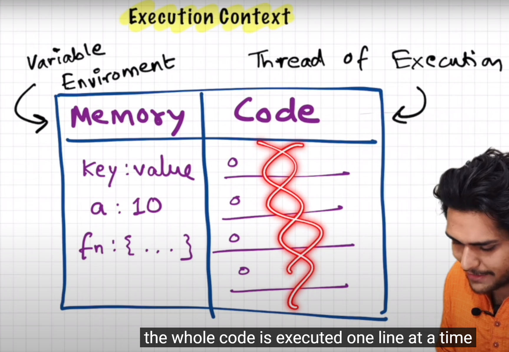
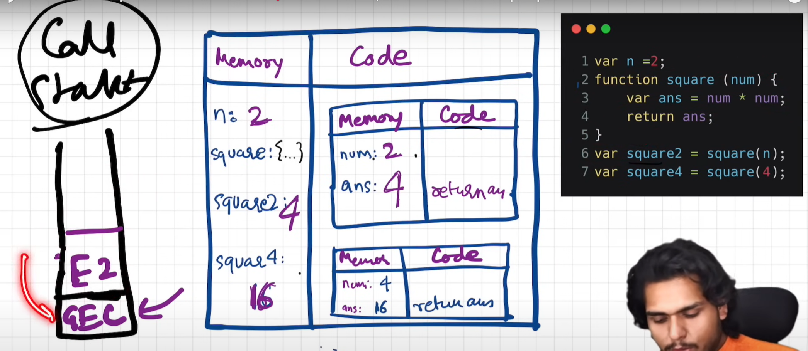

- [How JavaScript Works 🔥& Execution Context ](https://youtu.be/ZvbzSrg0afE?si=NW_CFyEti9tmHYRJ)

    - "JavaScript is a synchronous single-threaded language"

    - "Everything in JavaScript happens inside an Execution Context"

    - 

- [How JavaScript Code is executed? ❤️& Call Stack](https://youtu.be/iLWTnMzWtj4?si=lbsiQ8gVRcyRZgxK)

    - "Everything in JavaScript happens inside an Execution Context"

    - "Call stack maintains the order of execution of execution contexts"

    - 

    - Call Stack is also known as 

      1. Machine Stack
      2. Execution Context Stack
      3. Program Stack
      4. Control Stack
      5. Runtime Stack
