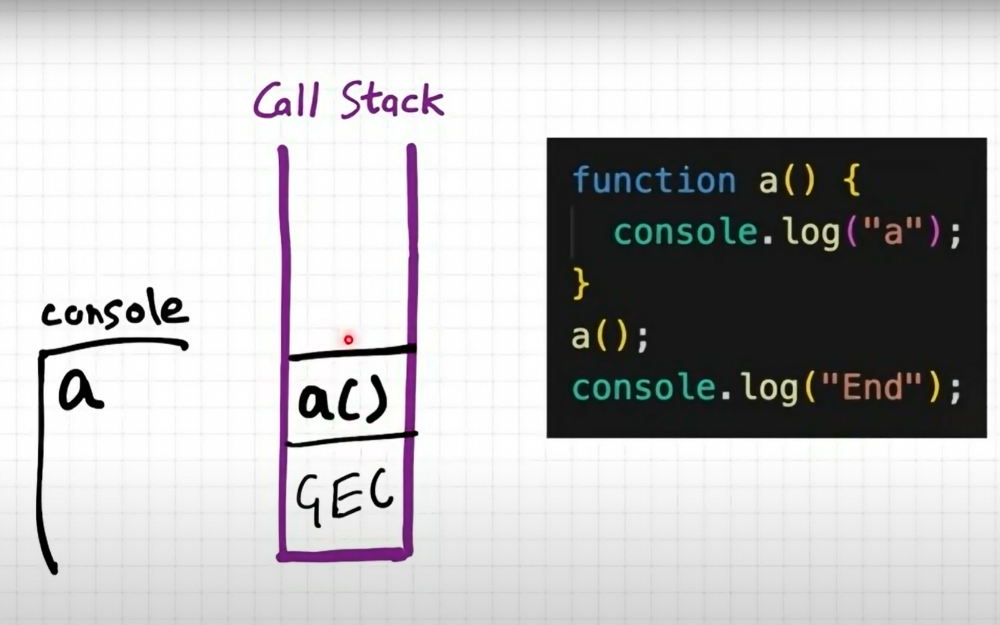
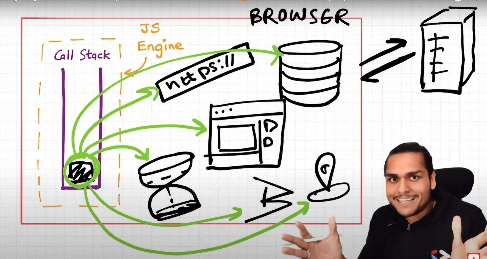
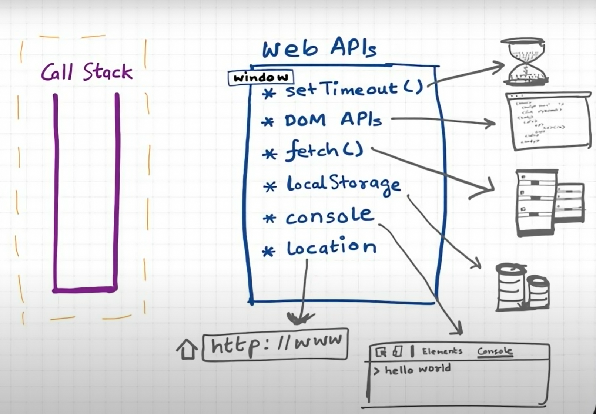
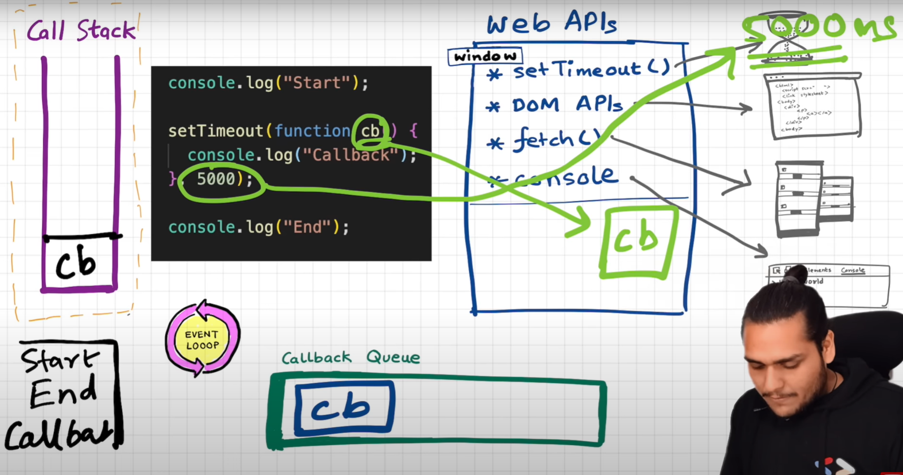
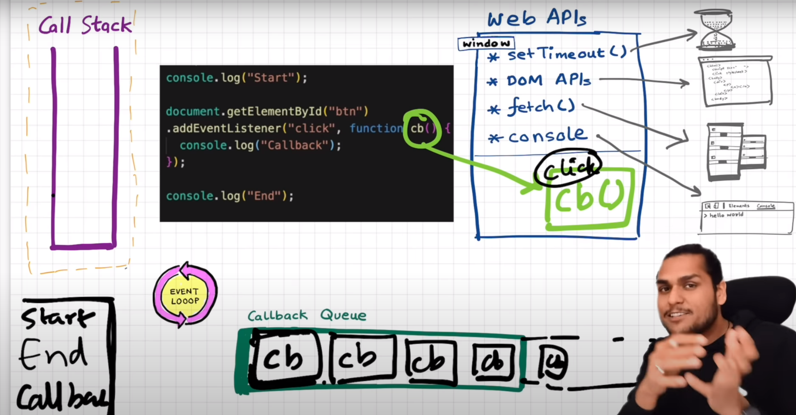
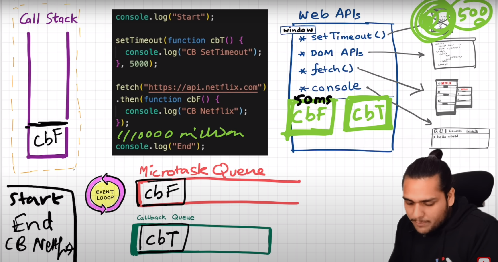
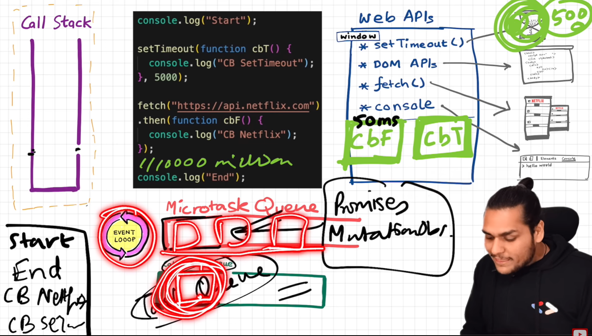

- [Asynchronous JavaScript & EVENT LOOP from scratch ](https://youtu.be/8zKuNo4ay8E?si=jVECwyu-M4u_rnuZ)

    - "Micro-task queue has higher priority than Callback queue(Task queue)"

    - "All the functions which come through promises and Mutation observers are go inside queue"

    - 

    - 

    - 

    - 

    - 

    - 

    - 