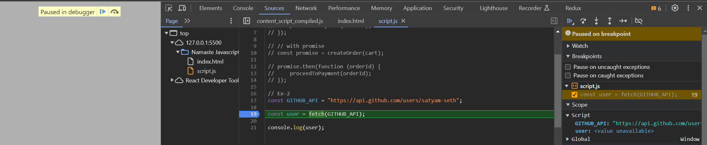
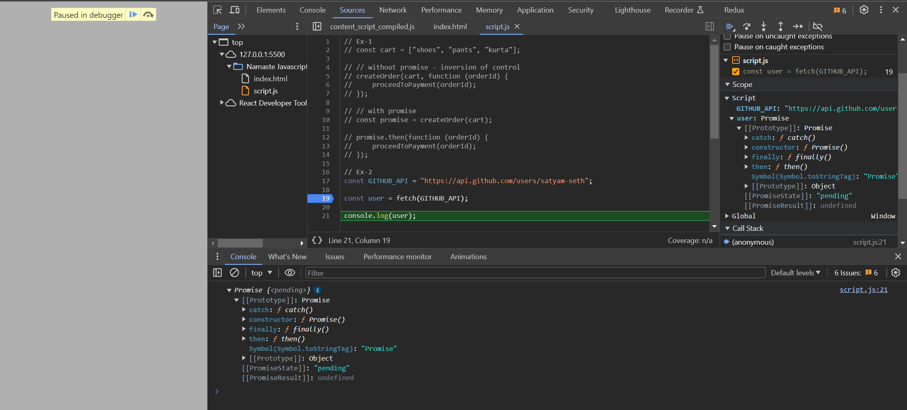
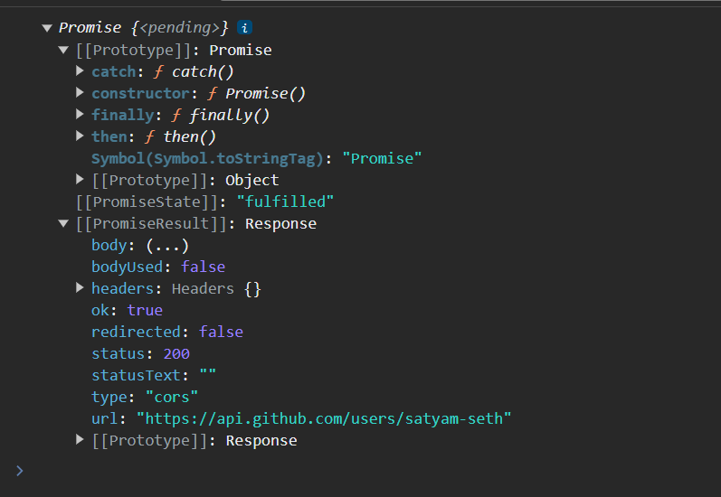
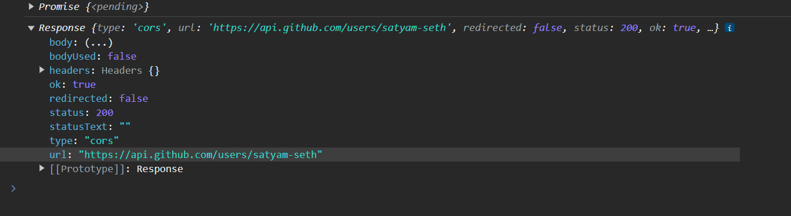

- [Promises](https://youtu.be/ap-6PPAuK1Y?si=5kNIfa1kglsVLvJM)

    - [Promise MDN Link](https://developer.mozilla.org/en-US/docs/Web/JavaScript/Reference/Global_Objects/Promise)

    - "The Promise object represents the eventual completion (or failure) of an asynchronous operation and its resulting value."

    - 

    - 

    - 

    - 