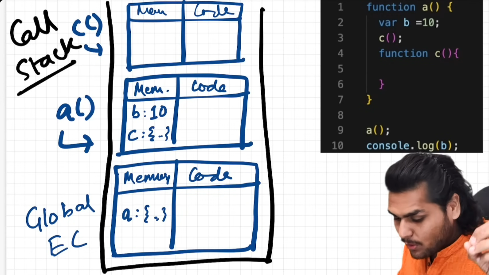
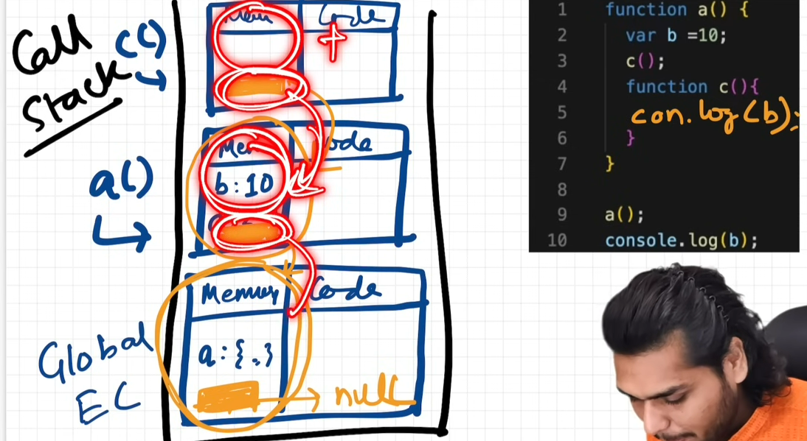

- [The Scope Chain, 🔥Scope & Lexical Environment](https://youtu.be/uH-tVP8MUs8?si=d9avFw_4_hiB1_3H)

    - "Scope in JavaScript is directly related to lexical environment"

    - "Whenever an execution context is create a lexical environment is also created"

    - "Lexical environment is local memory + reference to lexical environment of its parent"

    - 

    - 
