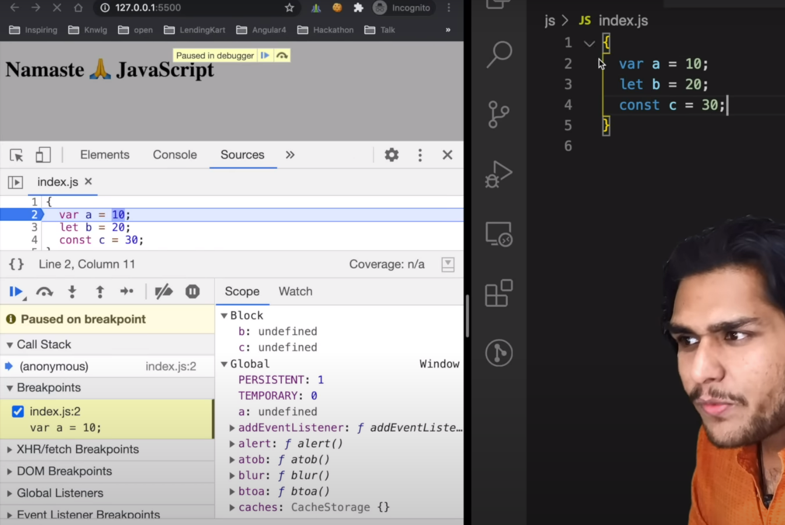

- [BLOCK SCOPE & Shadowing](https://youtu.be/lW_erSjyMeM?si=BGa5nN8Cc_kVcKle)

    - "Block is also known as compound statement"

    

    - "let and const are block scope"

    - "Scope concept is same for arrow function and normal function"