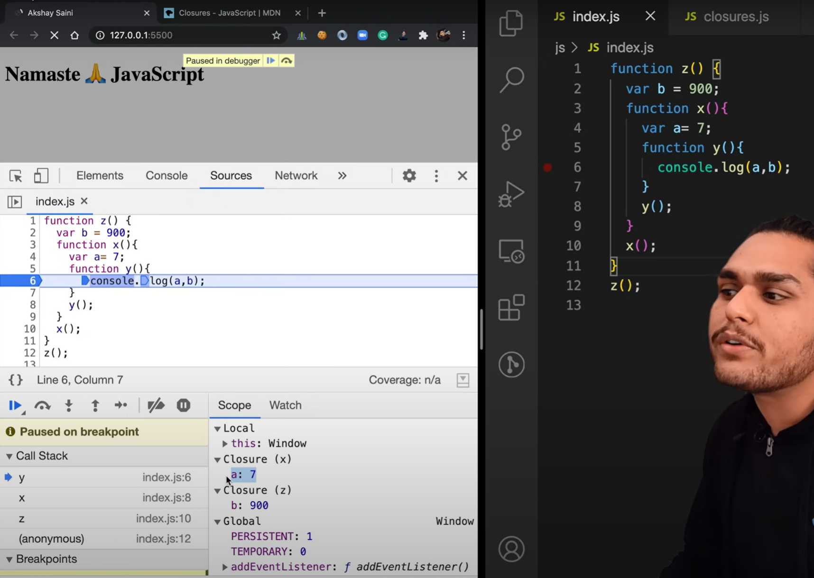

- [Closures](https://youtu.be/qikxEIxsXco?si=b92yyPYj1_hLBbl4)

    - "Function along with it Lexical environment called Closure"

    - 

    - Uses of Closures -

        - Module Design Pattern
        - Currying
        - Functions like once
        - Memoize
        - Maintaining state in async world
        - setTimeouts
        - Iterators
        - and many more.